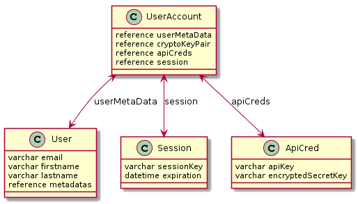
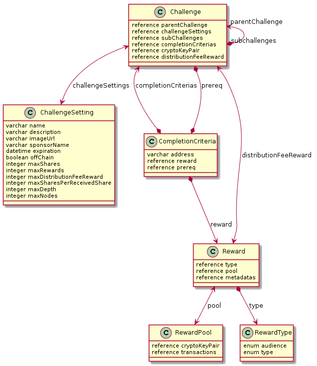
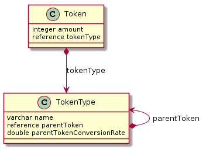
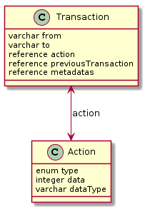

Table of Contents

1. [User Models](#user-models)
   + [Entity Relationship Diagram](#user-models-relationship-diagram)
   + [UserAccount](#useraccount)
   + [User](#user)
   + [ApiCred](#apiCred)
   + [Session](#session)
1. [Challenge Models](#challenge-models)
   + [Entity Relationship Diagram](#challenge-models-relationship-diagram)
   + [Challenge](#challenge)
   + [ChallengeSetting](#challengeSetting)
   + [CompletionCriteria](#completionCriteria)
   + [Reward](#reward)
   + [RewardPool](#rewardPool)
   + [RewardType](#rewardType)
1. [Token Models](#token-models)
   + [Entity Relationship Diagram](#token-models-relationship-diagram)
   + [Token](#token)
   + [TokenType](#tokenType)
1. [Transaction Models](#transaction-models)
   + [Entity Relationship Diagram](#transaction-models-relationship-diagram)
   + [Transaction](#transaction)
   + [Action](#action)
1. [Other Models](#other-models)
   + [CryptoKeyPair](#cryptoKeyPair)
   + [Metadata](#metadata)

#User Models

##User Models Relationship Diagram

## UserAccount

The parent model for all user-related information

#### Properties

1. userMetadata
   * Reference to User table
   * Required field
1. cryptoKeyPair
   * Reference to CryptoKeyPair table
   * Required field
1. apiCreds
   * Reference to ApiCred table
   * Required field
1. session
   * Reference to Session table
   * Required field

## User

The model that stores the metadata related to a user's account

#### Properties

1. email
   * varchar (length: 50)
   * Unique constraint
   * Required field
1. firstname
   * varchar (length: 20)
   * Required
1. lastname 
   * varchar (length: 20)
   * Required field
1. metadatas
   * Reference to Metadata table via UsersMetadata join table

## ApiCred

The ApiCred model stores credentials for a user to be able to interact with the API

#### Properties

1. apiKey
   * the public API key
   * varchar (length: 256)
   * required field
1. encryptedSecretKey
   * the encrypted version of the API secret key 
   * varchar (length: 256)
   * required field 

#Challenge Models

## Challenge Models Relationship Diagram

## Challenge

The Challenge model encapsulates all of the relevant data associated with a specific tree of transactions. More specifically, the “root node” is a sponsor who decides all of the parameters up front (see the properties below), which will determine the size and shape of the ensuing tree as transactions are made.

#### Properties

1. parentChallenge
   * A challenge might semantically be something along the lines of “build a car”. A child task of this broad goal could be something like “design the braking system”. All of these goals can be represented in this scheme as a “challenge”, and in this case, the “build a car” challenge would serve as the parent challenge. This property points to a parent challenge, if there is one.
   * Reference pointing to Challenges table
   * Optional field
1. challengeSettings
   * Reference pointing to ChallengeSettings table
   * Required field 
1. subChallenges
   * this is the representation of the children of a given challenge. See the description on the parentChallenge property above.
   * Relationship through ChallengeToSubChallenges join table
1. completionCriterias
   * Reference pointing to CompletionCriteria table
   * Required field
1. cryptoKeyPair
   * Reference pointing to CryptoKeyPair table
   * Required
1. distributionFeeReward
   * Reference pointing to Reward table
   * Required

## ChallengeSetting

The ChallengeSetting model stores all of the relevant metadata pertaining to a challenge. See the below properties for the specific metadata that is stored.

#### Properties

1. name
   * A string representing the semantic name of a challenge.
   * varchar (length: 100)
   * Required field
1. description
   * A string representing the description of the challenge, perhaps elaborating on the goal
   * varchar (length: 1000)
   * Required field
1. imageUrl 
   * A string representing a link to a logo for the challenge for visual display purposes
   * varchar (length: 100)
   * Required field
1. sponsorName
   * The name of the sponsor of the challenge (i.e. an organization name)
   * varchar (length: 100)
   * Required field
1. expiration
   * The date and time at which the challenge will expire (no more transactions can be made)
   * datetime
   * Required field
1. admin
   * A pointer to the UserAccount responsible for overseeing the challenge
   * Reference pointing to UserAccounts table
   * Required field
1. offChain
   * A boolean representing whether or not the challenge is being facilitated on or off-chain
   * Boolean
   * Required field
   * Default value of false
1. maxShares
   * The maximum number of transactions that can occur for the totality of the challenge
   * integer
   * Required field
1. maxRewards
   * The maximum asymptotic value for the total reward to be distributed over the challenge
   * integer
   * default of 1
   * Optional field
1. maxDistributionFeeReward
   * The maximum fee to be incurred for the cost of transactions on the network (i.e. Gas)
   * integer
   * default value of max integer value
   * Optional field
1. maxSharesPerReceivedShare
   * The maximum number of transactions that can ensue a given transaction in the challenge tree. In other words, this determines the size of a given sub-tree
   * integer
   * Default value of max integer value
   * Optional field
1. maxDepth
   * the maximum length of a provenance change (depth of the tree)
   * integer
   * default value of max integer value
   * Optional field
1. maxNodes
   * The maximum amount of key pairs that can be involved in the tree
   * integer
   * default value of max integer value
   * Optional field

## CompletionCriteria

The CompletionCriteria model serves as a validator for the completion of a challenge

#### Properties

1. address
   * The public key of the user that is able to trigger completion of a challenge
   * varchar (length: 256)
   * Required field
1. reward
   * Reference pointing to Reward table
   * Required field
1. prereq 
   * A reference to the challenge that would have to precede the criteria in this instance
   * Relationship to Challenge table via PrerequisiteChallenge join table

## Reward

A model representing all data properties associated with the reward for completion of a challenge instance 

#### Properties

1. type
   * Reference pointing to RewardType table
   * Required field
1. pool
   * Reference to RewardPool table
   * Required field
1. metadatas
   * Any extra metadata for the reward
   * Relationship to Metadata model through RewardsMetadata table
   * RewardsMetadata table is a join between Rewards and Metadatas

## RewardPool

A model that serves as a collection of all transactions related to a particular reward

#### Properties

1. cryptoKeyPair
   * A reward pool has its own key pair in order to be able to facilitate transactions on its own based on settings of a challenge
   * Reference pointing to CryptoKeyPair table
   * Required field
1. transactions
   * All transactions pertaining to the reward pool
   * Relationship to the Transaction table via the RewardsToTransactions join table

## RewardType

A model representation of all metadata to properly describe the type of reward

#### Properties

1. audience
   * Represents the scope of the reward. It can be distributed over an entire challenge tree or a single provenance chain within a tree
   * enum class
   * Required field
   * Values
       * PROVIDENCE
       * FULL
1. type
   * How the rewards are mathematically distributed over the audience
   * enum class
   * Required field
   * Values
      * SINGLE
      * EVEN
      * LOGARITHMIC
      * EXPONENTIAL
      * N_OVER_2

# Token Models

## Token Models Relationship Diagram

## Token

A model representation of a token on the network. Tokens of different types can exist on the network, so this parent entity tracks the amount of each type

1. amount
   * The amount of a tokenType on the network
   * integer
   * Required field
1. tokenType
   * Reference pointing to TokenType table
   * Required field

## TokenType

This model stores all other metadata corresponding to a specific type of token on the network

#### Properties

1. name
   * The name of the tokenType
   * varchar (length: 100)
   * Unique constraint
   * Required field
1. parentToken
   * A pointer to the parent tokenType, if there is one
   * Reference pointing to TokenType table
   * Optional field
1. parentTokenConversionRate
   * A representation of the conversion rate between a tokenType and its parent
   * Double
   * Optional field

# Transaction Models

## Transaction Models Relationship Diagram

## Transaction

A model representing any “event” - or a change in data that occurs on-chain. Examples of a transaction could be the creation of a challenge, the expiration of a challenge, or simply the transfer of tokens from one key pair to another

#### Properties

1. from
   * The public key from which the transaction occurs
   * varchar (length: 256)
   * Required field
1. to
   * The public key to which the transaction ends, if there is one. a challenge expiration, for example, would not need this data field
   * varchar (length: 256)
   * Optional field (in the case of a pure state change for a challenge)
1. action
   * Reference to Action table
   * Required field 
1. previousTransaction
   * A link to the transaction that occurred before this one (to track the tree)
   * Reference to Transaction table
   * Optional
1. metadatas
   * Reference to Metadata table through TransactionsMetadata join table

## Action

The Action model stores the semantic metadata for a Transaction instance. Given that a transaction can represent much more than the sharing of tokens from one wallet to another (i.e. challenge creation, expiration, etc.), it makes sense to store this data separately from the transaction entity itself.

#### Properties

1. type
   * an enum value providing a semantic representation of the type of transaction that is occurring 
   * enum 
   * required field
   * possible values
      * TRANSFER
      * CREATE
      * SHARE
      * PAYOUT
      * ACTIVATE
      * COMPLETE
      * INVALIDATE
      * EXPIRE
1. data
   * the ID of the entity that is the subject of the transaction that this action is associated with
   * integer
   * required field 
1. dataType
   * the type of data from the above property
   * varchar (length: 100)
   * required field

# Other Models

## CryptoKeyPair

This model serves as a representation of a key pair on the blockchain

#### Properties

1. publicKey
   * varchar (length: 256)
   * Required field
1. encryptedPrivateKey
   * varchar (length: 256)
   * Required field

## Metadata

This model is just a key-value store to be used by other models in the schema to hold any other relevant metadata. 

#### Properties

1. key
   * varchar (length: 256)
   * Required field
1. value
   * varchar (length: 256)
   * Required field
   

